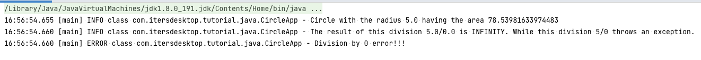
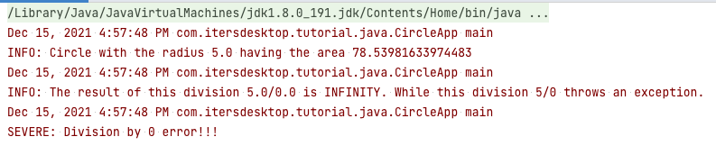

# Demonstration of using SLF4J with various logging frameworks
In this project, I want to show you different usages of the popular logging wrapper, [SLF4J](http://www.slf4j.org/), 
in the same context to help you gain basic knowledge about this logging tool.

## Introduction
As of writing this document, there have been two most widely used logging wrappers that are SLF4J and JCL ([Apache Java 
Commons Logging](https://commons.apache.org/proper/commons-logging/)). We can view these wrappers as an abstraction 
or interface to logging process. A specific logging framework will be detected at runtime by these wrappers if it is 
defined in the class paths. In other words, we have to declare appropriate dependencies to allow SFL4J to be 
coordinated with either of log4j (version 1.x and 2.x), logback, 
[simplelogger](https://mvnrepository.com/artifact/org.slf4j/slf4j-simple), or java util logging (JUL). The steps of 
testing are detailed below. 

## How to test logging implementations
This is a Maven-based project where the dependencies are defined in the `pom.xml` file. To test each logging 
framework and avoid unexpected side effects, I recommend you to uncomment the required dependencies and comment the 
others. 

For example: the snippet below shows three different sections of defining logging frameworks. The current version is 
enabling the Java Logging API while the others are disabled.  
```
<dependencies>
    <!-- logging -->

    <!-- SimpleLogger framework -->
    <!--<dependency>
        <groupId>org.slf4j</groupId>
        <artifactId>slf4j-simple</artifactId>
        <version>1.7.32</version>
    </dependency>-->

    <!-- Logback framework -->
    <!--<dependency>
        <groupId>ch.qos.logback</groupId>
        <artifactId>logback-classic</artifactId>
        <version>${logback.version}</version>
    </dependency>-->

    <!-- Java util logging (JUL) (aka. Java Logging API) framework -->
    <dependency>
        <groupId>org.slf4j</groupId>
        <artifactId>slf4j-api</artifactId>
        <version>1.7.32</version>
    </dependency>
    <dependency>
        <groupId>org.slf4j</groupId>
        <artifactId>slf4j-jdk14</artifactId>
        <version>1.7.32</version>
        <scope>runtime</scope>
    </dependency>
</dependencies>
```

*Notes*: don't uncomment two different frameworks to prevent unexpected conflicts.

## Analysis
### `MainEntry` class
In the `main` method, we directly use the logging levels from an instance of the object `java.util.logging.Logger`. 
It won't be affected when changing dependencies. The `Logger` class has `severe` level which is equivalent to 
`error` in the other logging frameworks. We are going to see this change in the next section. 

### `CircleApp` class
In the `main` method, we have tried three common different levels. Switching between frameworks, we don't 
have to change levels such as `serve` to `error`. The facade will perform the exchangeability for us. The output format 
looks different, see the screenshots below.






